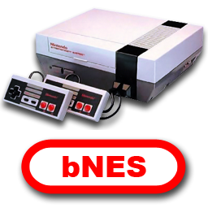
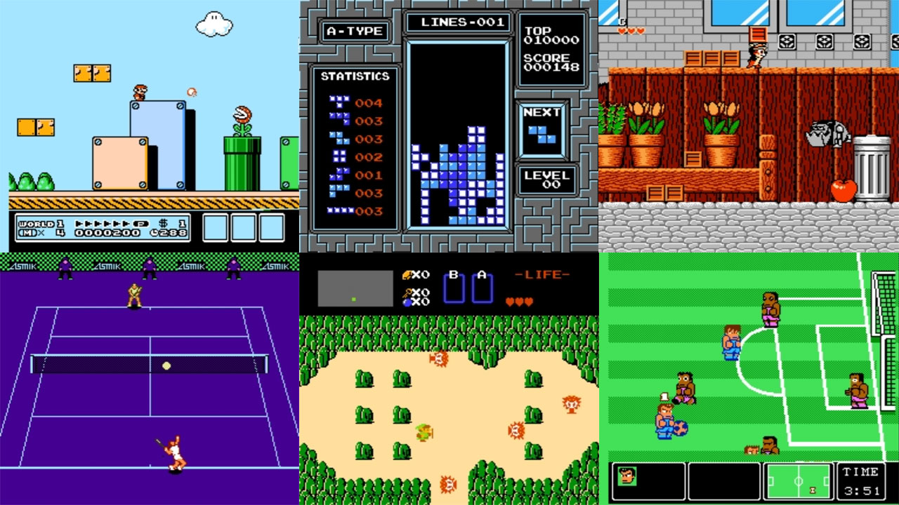
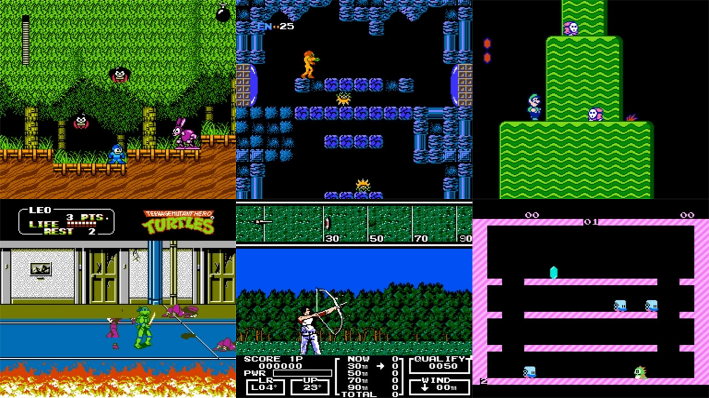

# Nintendo - NES / Famicom (bnes)

### Description

A libretro port of bNES, a NES emulator originally created by Byuu.

### License

GPLv3

### Icon

### Fanart

Help make me fanart!

### Screenshots

### Disclaimer

*In loving memory of Near / Byuu*
